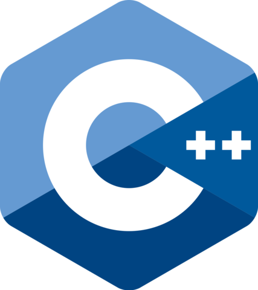
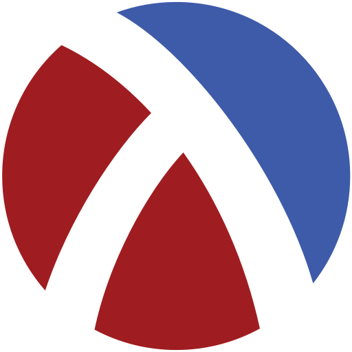

# Dev-Stuff
---
Here's where I save all my most outstanding works, applications and code as a developer during my B.S. in Computer Science career

### About me:
A BS in Computer Science and Technology student at the Tecnológico de Monterrey University, with diverse knowledge in computer programming and application development. Adaptable to all work environments, with a strong sense of emotional intelligence and responsibility, willing to work as a team, always keeping in mind honesty, respect and tolerance. Eager to pursue a career in computer science with possibly a data science specialization.

### Areas of Interest:
Data Science, Web Development & Design, Data Bases, Videogame Development

## Content
<table>
  <tr>
    <th>ID</th><th>Name</th><th>Description</th>
  </tr>
  <tr>
    <td>1</td><td>
       Python
    </td><td>Python scripts I wrote</td>
  </tr>
  <tr>
    <td>2</td><td>
       C++
    </td><td>C++ scripts and projects that involve OOP, data structures and advanced algorithms</td>
  </tr>
  <tr>
    <td>3</td><td>
       Unity/  C#
    </td><td>Unity projects I've coded with C#</td>
  </tr>
  <tr>
    <td>4</td><td>
       JavaScript
    </td><td>There are multiple projects, most of them of web development, that use JavaScript</td>
  </tr>
  <tr>
    <td>5</td><td>
       HTML
    </td><td>There are multiple projects, most of them of web development, that use HTML</td>
  </tr>
  <tr>
    <td>6</td><td>
       CSS
    </td><td>There are multiple projects, most of them of web development, that use CSS</td>
  </tr>
  <tr>
    <td>7</td><td>
       React
    </td><td>Web part of a two-sided application for a doctor in React</td>
  </tr>
  <tr>
    <td>8</td><td>
       Vue3
    </td><td>A Walmart web page clone in Vue3</td>
  </tr>
  <tr>
    <td>9</td><td>
       Django
    </td><td>A project that is used to create and use predictive models with certain file inputs for CEMEX</td>
  </tr>
  <tr>
    <td>10</td><td>
       Scheme (Racket)
    </td><td>A syntax highlighter programmed in Racket/Scheme language</td>
  </tr>
  <tr>
    <td>11</td><td>
       R
    </td><td>Scripts for analyzing DNA data and more information in R</td>
  </tr>
  <tr>
    <td>13</td><td>
       Swi Prolog
    </td><td>Parallel programming using SWI PROLOG</td>
  </tr>
  <tr>
    <td>14</td><td>
       MATLAB
    </td><td>Scripts of different excercises and projects made in MATLAB</td>
  </tr>
</table>
